# Rental Library Management System

A comprehensive library management web application designed for renting and managing books.

## Features
- **Browse Books**: Discover books by genre, author, or title.
- **User Authentication**: Secure login and registration for members and admins.
- **Rental System**: Manage book rentals, returns, and late fee calculations.
- **Admin Dashboard**: Manage the book catalog, user accounts, and rental history.
- **Dynamic Recommendations**: Personalized book suggestions based on rental history.

## Screenshots

### Home & Exploration
| Home Page | Catalog Page | Browse by Category |
| :---: | :---: | :---: |
| 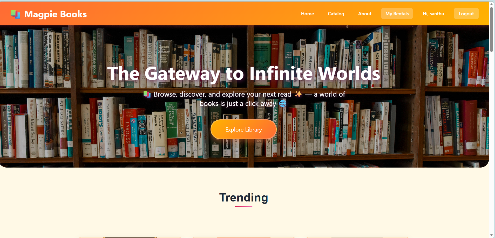 | 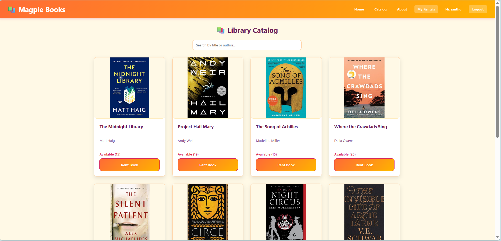 | 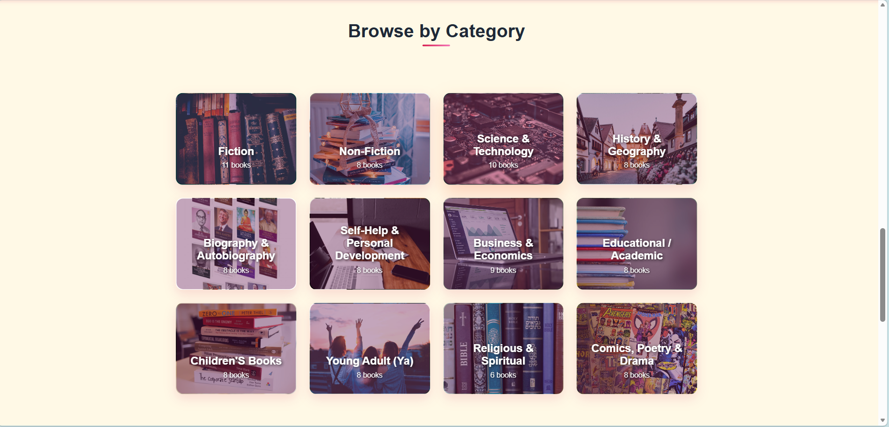 |

### Book Details & Renting
| Book Renting | Payment | Confirm Payment |
| :---: | :---: | :---: |
| 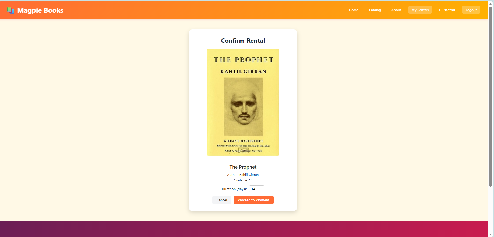 | 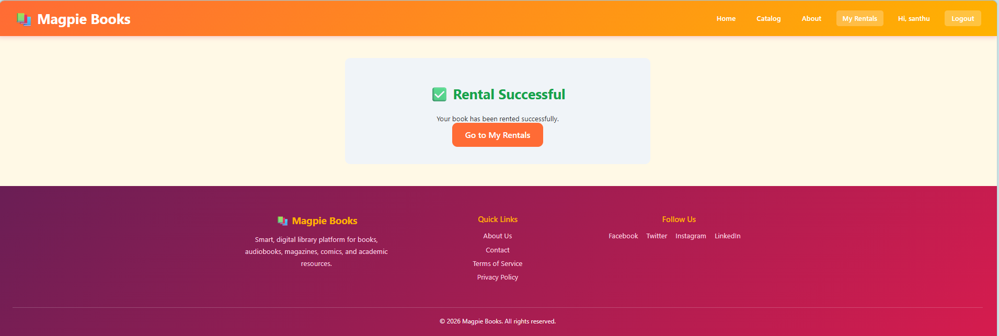 | 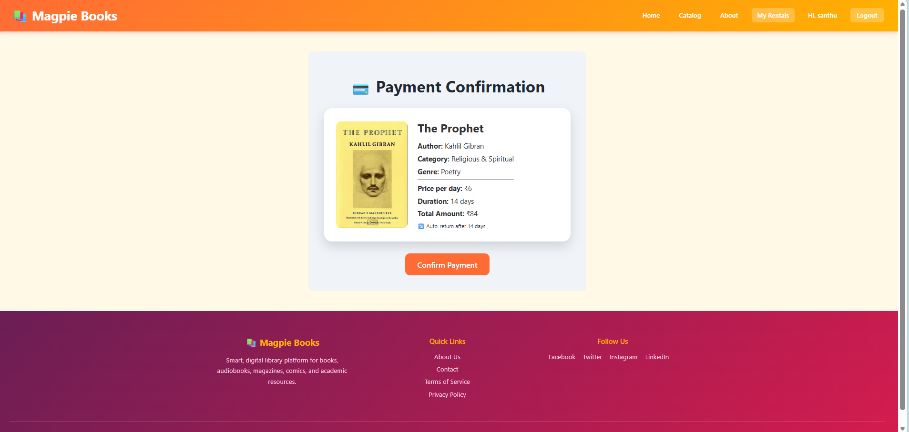 |

### User Profile & My Rentals
| My Rentals | Profile Update | Check-in Rentals |
| :---: | :---: | :---: |
| 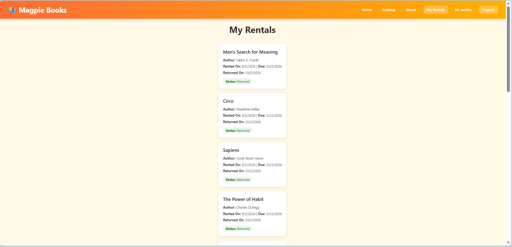 | 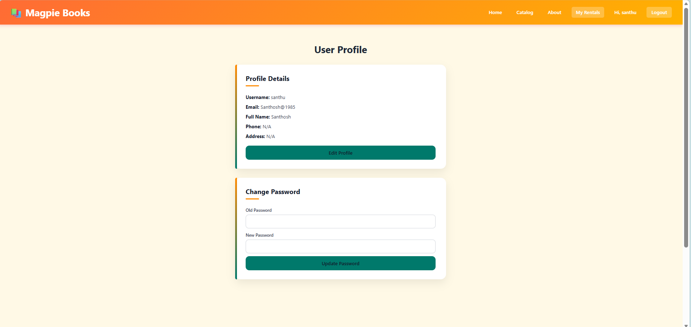 | 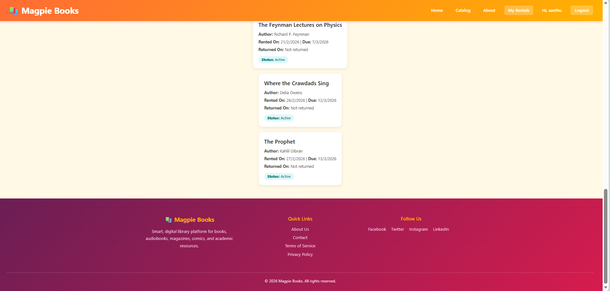 |

### Admin Dashboard
| Admin Dashboard | Books Management | User Management |
| :---: | :---: | :---: |
| 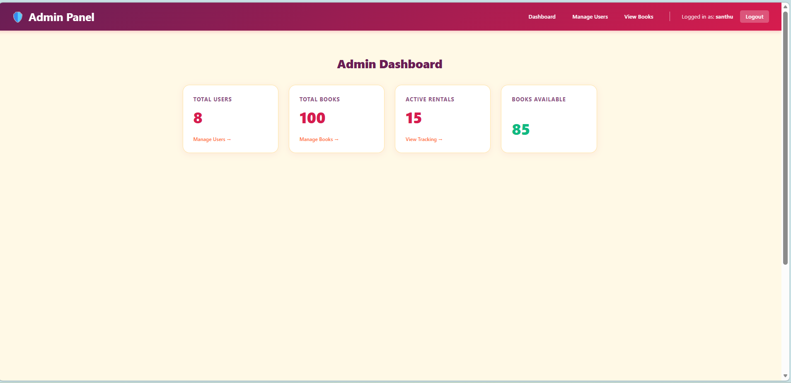 | 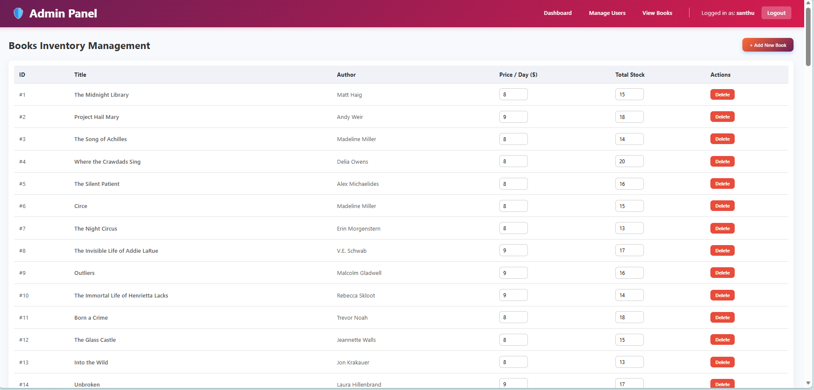 | 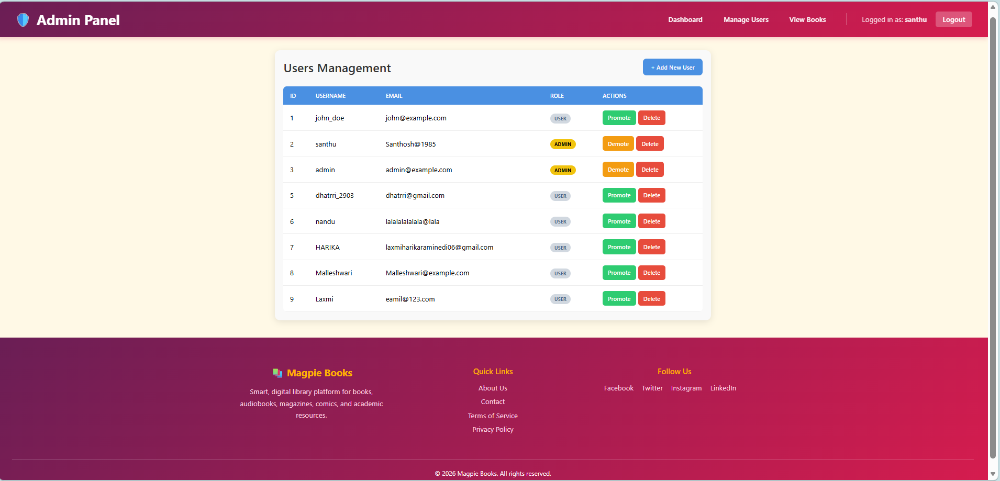 |

### Trending & More
| Trending Books | Featured Authors | About Page |
| :---: | :---: | :---: |
| 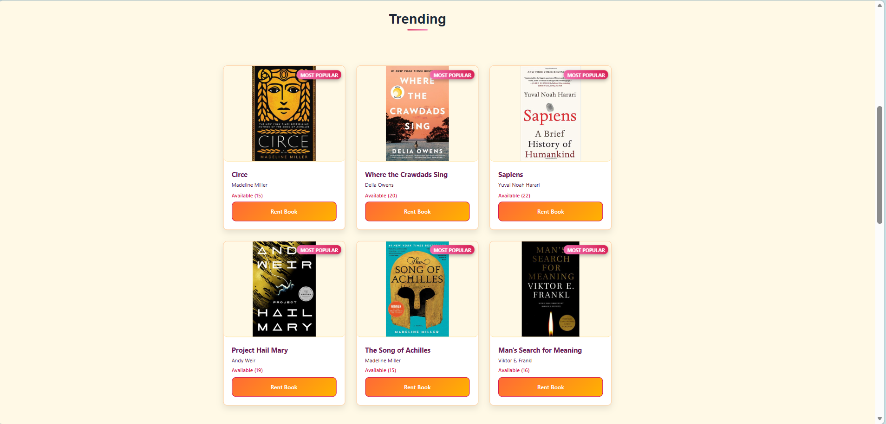 | 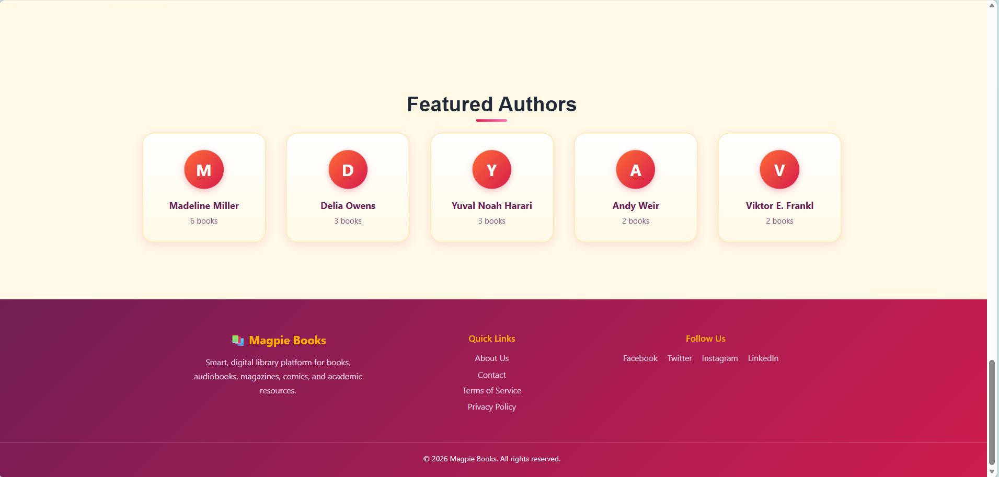 | 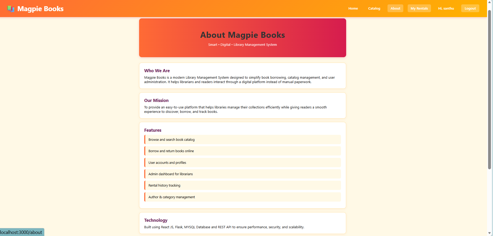 |


## Technology Stack
- **Frontend**: React.js, Vanilla CSS, Lucide-React icons.
- **Backend**: Python (Flask), SQLite/JSON.
- **Database**: Local JSON storage for book data.

## Getting Started

Follow these steps to set up the project locally.

### Prerequisites
- [Node.js](https://nodejs.org/) (v14 or higher)
- [Python](https://www.python.org/) (v3.8 or higher)

### Installation

1. **Clone the Repository**:
   ```bash
   git clone https://github.com/Laxmiharika522/Rental-Library-Management-System.git
   cd Rental-Library-Management-System
   ```

2. **Backend Setup**:
   ```bash
   cd backend
   python -m venv venv
   source venv/bin/activate  # On Windows: venv\Scripts\activate
   pip install -r requirements.txt
   python app.py
   ```

3. **Frontend Setup**:
   ```bash
   cd ../frontend
   npm install
   npm start
   ```

## Usage
- Access the frontend at `http://localhost:3000`.
- The backend API runs at `http://localhost:5000`.

## License
MIT License
